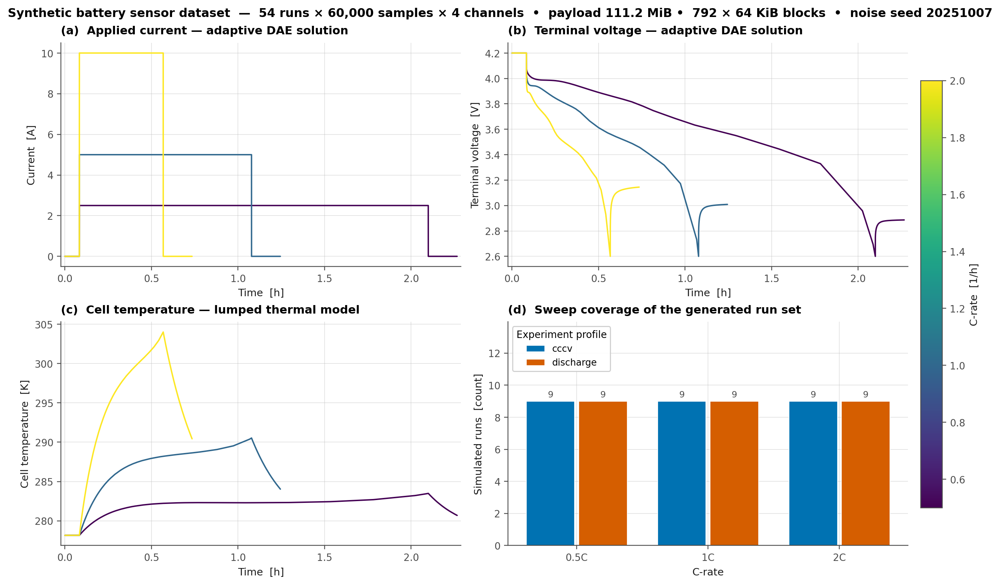
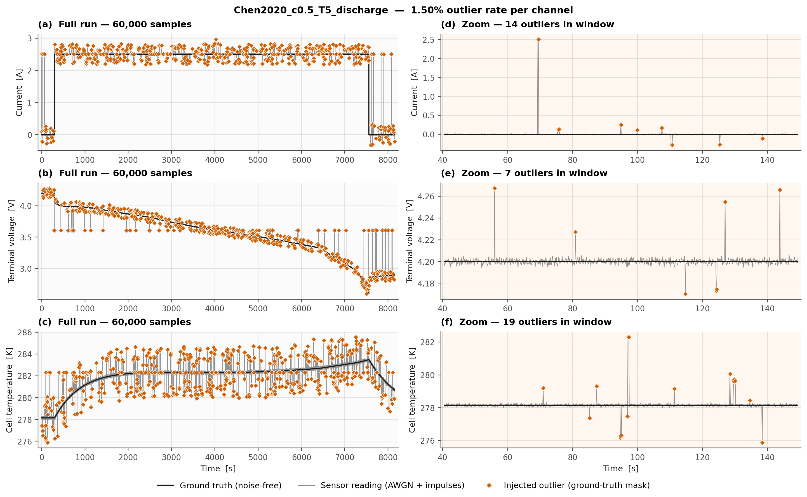
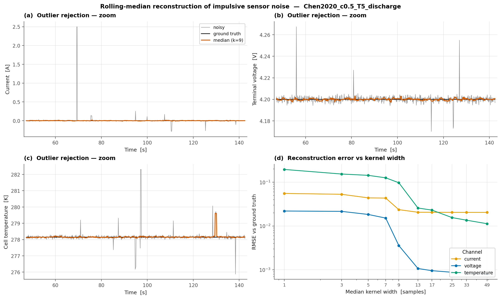
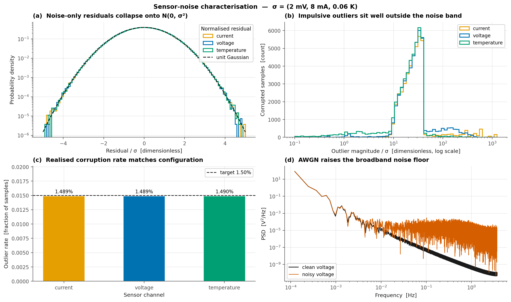
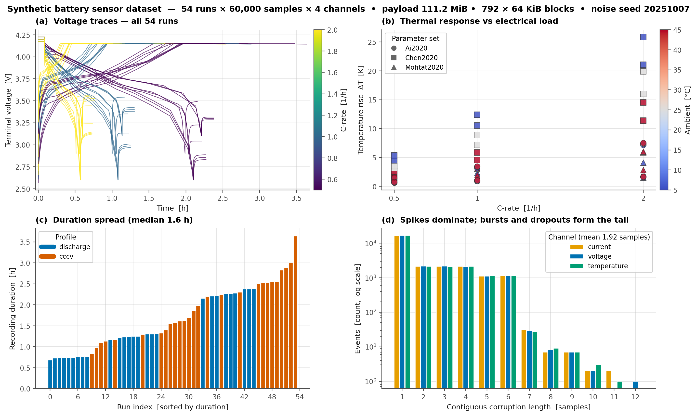

# Real-Time Multi-Core Sorting and Median Filter Service

The client continuously offloads unsorted floating-point time-series metrics (≥ 64 KB) to the server. The server implements a parallel Merge-Sort algorithm across multiple worker threads, using mutexes and condition variables to control the recursive merging phases across partitioned memory. In addition, the server computes rolling median filters to eliminate sensor outliers. On completion, the server sends a QNX pulse event back to the client with the calculated median and memory-offset descriptor.

The workload this service is built around is synthesised offline, so it can be
replayed at realistic volumes with a known ground truth: multi-channel battery
recordings carrying Gaussian sensor noise and impulsive outliers, together with
the injection mask a median filter can be scored against.

## Repository layout

| Path | Contents |
| --- | --- |
| `README.md` | this file |
| `CHANGELOG.md` | what changed, and why |
| `data/` | PyBaMM generator for the synthetic client payload (`src/battery_dataset/`) |
| `data/artifacts/dataset/` | generated payload — `.npz`, manifest, CSV (git-ignored, ≈ 370 MiB) |
| `data/artifacts/figures/` | generated diagnostic figures (committed; shown below) |

## Generating the dataset — one command

```bash
cd data
uv run python -m battery_dataset
```

That command does everything: solves the simulations, injects the sensor noise,
writes the `.npz` payload, the `metadata.json` manifest and every CSV, and
renders the figures. `uv run battery-dataset` is the equivalent console script.
`uv` installs PyBaMM, NumPy and Matplotlib on first run, so there is no manual
setup. The full sweep takes about 50 s.

| Flag | Effect |
| --- | --- |
| `--quick` | 3 runs × 4 000 samples smoke build |
| `--runs N` | limit the number of runs |
| `--samples N` | samples per run |
| `--seed N` | outlier RNG seed |
| `--output-dir DIR` | write artefacts somewhere else |
| `--no-csv`, `--no-plots` | skip the CSV rendering / the figures |

The generator is split into small modules (`config`, `simulate`, `noise`,
`dataset`, `csvio`, `plot`) rather than one long script. It stays a package
because `uv` needs `pyproject.toml` to pin those dependencies anyway, and the
single command above is unchanged either way.

## What a run is

Every run is one PyBaMM simulation: a single-particle model (`SPM`) with a
lumped thermal submodel, which yields three sensor channels over time —
current, terminal voltage and cell temperature. The sweep is the full
combination of four axes:

| Axis | Values | Runs |
| --- | --- | --- |
| Cell | LG M50, graphite/NMC532 pouch, Enertech | 18 each |
| C-rate | 0.5C, 1C, 2C | 18 each |
| Ambient temperature | 5 °C, 25 °C, 45 °C | 18 each |
| Experiment | `discharge` (rest → full discharge → rest), `cccv` (CC charge → CV hold → rest) | 27 each |
| | | **54 runs** |

That is 27 unique cell × C-rate × temperature combinations, each simulated
twice. A discharge run starts full and ends at the cell's lower cut-off; a
`cccv` run starts empty and charges to the upper cut-off. Every run is resampled
onto a fixed grid, giving a `(54, 60000, 4)` tensor over the channels
`time_s, current_A, voltage_V, temperature_K`.

| Quantity | Value |
| --- | --- |
| Runs | 54 |
| Samples per run | 60 000 |
| Sample rows, all runs | 3 240 000 |
| Run duration | 0.68 h – 3.64 h (median 1.56 h) |
| Temperature rise at 2C | 1.5 K – 26 K |
| `.npz` payload | 111.2 MiB = 792 × 64 KiB blocks |
| CSV files | 55 (54 run files + 1 index) |

## How it is corrupted

`time_s` is never touched. Each sensor channel gets additive white Gaussian
noise — voltage 2 mV, current 8 mA, temperature 0.06 K — plus impulsive
outliers: single-sample spikes, contiguous bursts, and stuck readings that hold
a constant value. Spikes are 10–40 σ, far outside the noise band, and the outlier
rate is 1.5 % of samples per channel (48 244 / 48 259 / 48 260 corrupted samples
for current / voltage / temperature). These are exactly the artefacts a rolling
median filter is meant to remove, and the injected mask is stored alongside the
corrupted readings so the removal can be measured rather than judged by eye.

Noise placement is seeded per run, so regenerating produces the same dataset.

## Cell selection

Three physically distinct cells, chosen because the temperature channel has to
carry a real signal rather than only noise:

| Parameter set | Cell | Capacity | Temperature rise at 2C |
| --- | --- | --- | --- |
| `Chen2020` | LG M50 | 5.000 Ah | 19.9 K |
| `Mohtat2020` | graphite/NMC532 pouch | 5.000 Ah | 5.8 K |
| `Ai2020` | Enertech cell | 2.280 Ah | 7.4 K |

Rejected: `OKane2022` / `ORegan2022` (the same LG M50 cell as `Chen2020`, so
they would duplicate a cell rather than add variety); `Marquis2019`,
`Ecker2015`, `NCA_Kim2011` (temperature rise of 0.61 K, 0.23 K and 0.01 K —
below the 0.06 K noise floor, so the channel would be noise-dominated);
`Prada2013`, `Ramadass2004`, `Xu2019`, `MSMR_Example` and the half-cell sets
(no cell volume, cooling area or heat-transfer coefficient, so the thermal model
cannot be solved); `Sulzer2019` (lead-acid, not a lithium-ion cell).

## Outputs

```
data/artifacts/
├── dataset/
│   ├── battery_sensor_dataset.npz     # clean, noisy, outlier_mask, duration_s, run_ids
│   ├── metadata.json                  # build config, cell identities, shapes, per-run stats
│   ├── csv_index.csv                  # manifest of the 54 run CSVs
│   └── csv/<run_id>.csv               # 54 files, one per run
└── figures/                           # 5 PNGs, shown below
```

**CSV files — 55 in total**: 54 per-run files plus one index. Each run file has
60 000 rows (one sample per row) and 11 columns, so it is self-contained and can
be read without Python:

```
sample_index, time_s, current_A, voltage_V, temperature_K,     ← clean / ground truth
current_A_noisy, voltage_V_noisy, temperature_K_noisy,          ← what the sensor reports
outlier_current, outlier_voltage, outlier_temperature           ← 1 where a spike was injected
```

The `.npz` is the primary artefact (compact, exact); the CSVs reproduce it
column for column.

Two caveats worth stating plainly. The `outlier_*` flags are the **injected
ground truth**, not the output of a detector — no outlier detection is
implemented yet, so these columns are the answer key, not a result. And the
median filter exists as a reference implementation used only to draw figure 03;
nothing filtered is persisted to disk.

## Figures

### 01 — Signal overview

The sweep at a glance: one current, voltage and temperature trace per C-rate,
plus a bar chart confirming all 27 cell × C-rate × temperature combinations were
covered for both experiments.



### 02 — Noise injection

The key picture: one run, all three channels, whole run and zoomed in — clean
truth, the noisy reading, and every injected outlier marked. This is what
justifies a median filter: the spikes are large and isolated.



### 03 — Median filter recovery

The same zoom with a rolling median applied, next to the reconstruction error as
the kernel widens. Voltage has a clear sweet spot around 9 samples; current and
temperature keep a residual floor because a median across a step or a ramp is
biased. Filter output is computed for this figure only and is not saved.



### 04 — Noise statistics

Evidence that the corruption is what it claims to be: residuals collapse onto a
Gaussian, outlier magnitudes sit at 10–40 σ, the realised 1.5 % rate matches the
configured one, and the noise raises the broadband floor of the voltage
spectrum.



### 05 — Run gallery

How much the runs vary: all 54 voltage traces coloured by C-rate, temperature
rise against C-rate per cell, the duration spread, and the spike / burst /
dropout length distribution.


